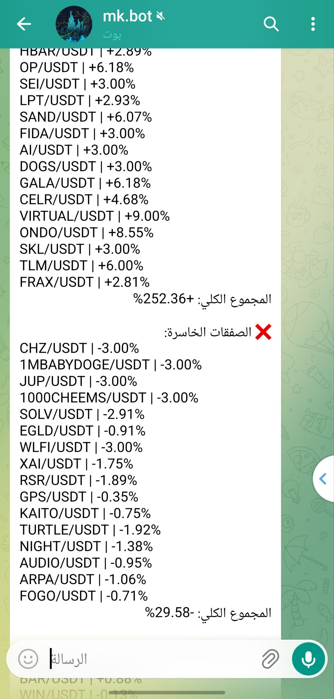
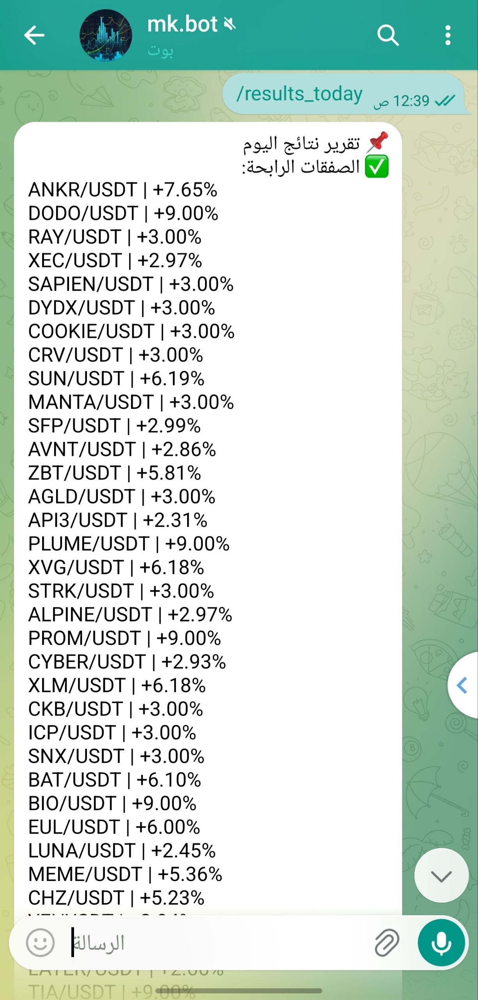
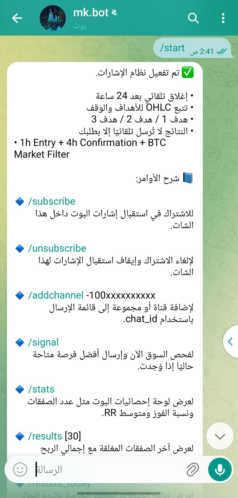
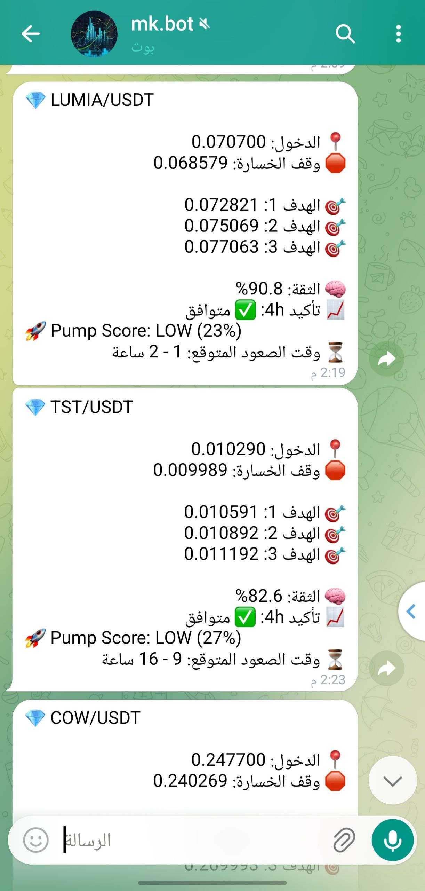
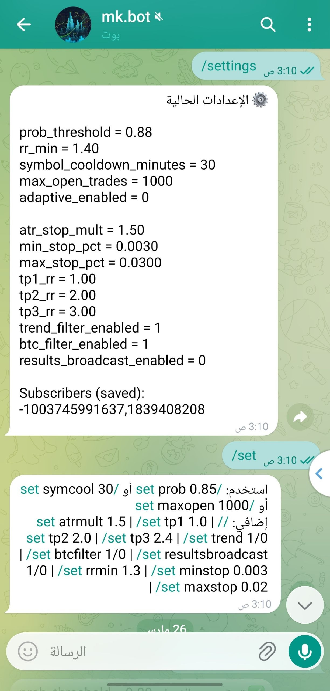

# 🤖 AI Trading Bot

AI-powered cryptocurrency trading bot for real-time market analysis, trade signal generation, and performance tracking.

---

## 🚀 Features

- Machine Learning model using **XGBoost**
- Real-time market scanning across multiple trading pairs
- Binance API integration using **CCXT**
- Telegram bot for live trade alerts and notifications
- Backtesting system for strategy evaluation
- Performance tracking (win rate, profit/loss)
- Multi-timeframe analysis (1H / 4H)
- Dynamic Stop-Loss and Take-Profit strategies

---

## 🛠️ Tech Stack

- Python  
- XGBoost  
- CCXT (Binance API)  
- SQLite  
- Telegram Bot API  

---

## 📸 Screenshots

### 🔔 Telegram Alerts
  
  
  

### 📊 More Signals
  
  

---

## 📖 Project Overview

This project analyzes cryptocurrency market data using machine learning and technical indicators to identify high-probability trading opportunities.

The system scans the market in real time, evaluates trading signals, and sends alerts through Telegram based on predefined strategies and AI predictions.

---

## 📂 Project Structure

- `bot.py` → Main trading bot logic  
- `db.py` → Database management  
- `check_stats.py` → Performance analysis  
- `backtest_all.py` → Backtesting system  
- `train_tp_sl_model_1h_bot_features.py` → AI model training  
- `migrate_db.py` → Database updates  

---

## ⚠️ Disclaimer

This project is for educational purposes only.  
It does not provide financial advice or guarantee profits.

---

## 📫 Contact

- Email: mohammedkhaledalkhaled@gmail.com  
- GitHub: https://github.com/mohammedkhaledalkhaled-maker  

---

⭐️ If you like this project, feel free to star the repository!
